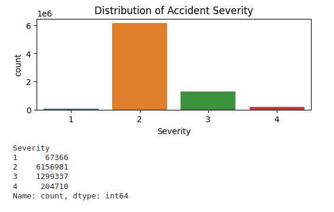
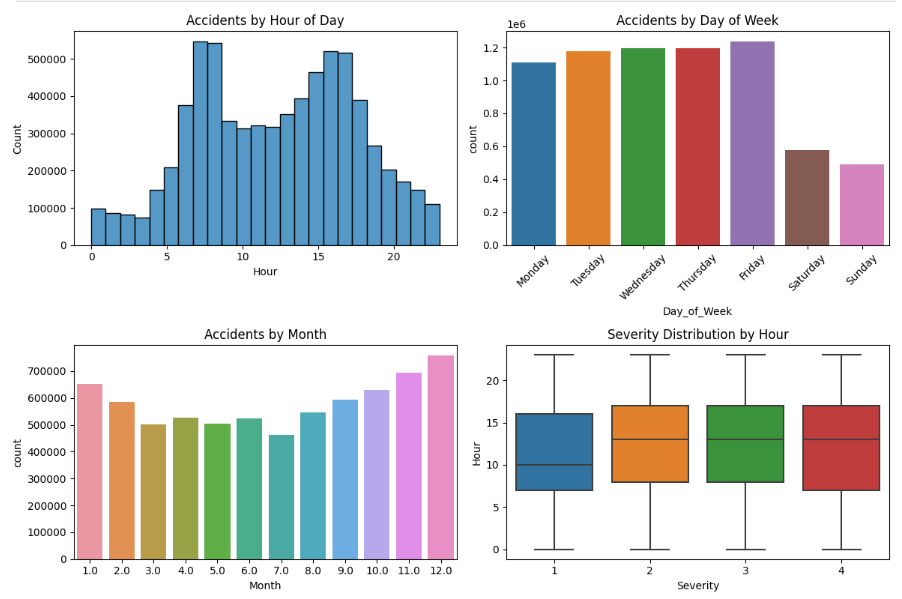
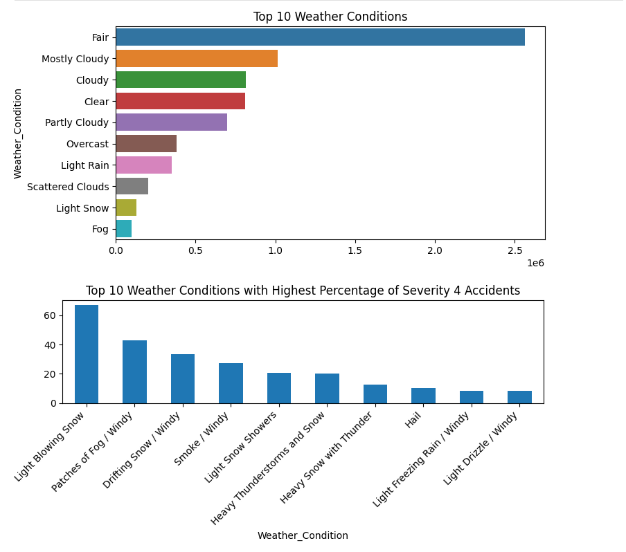
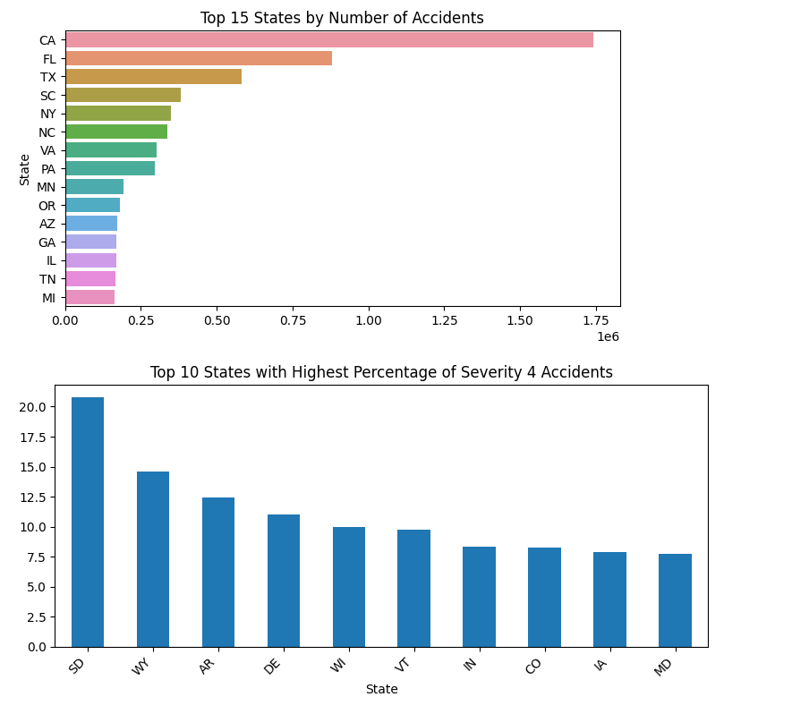
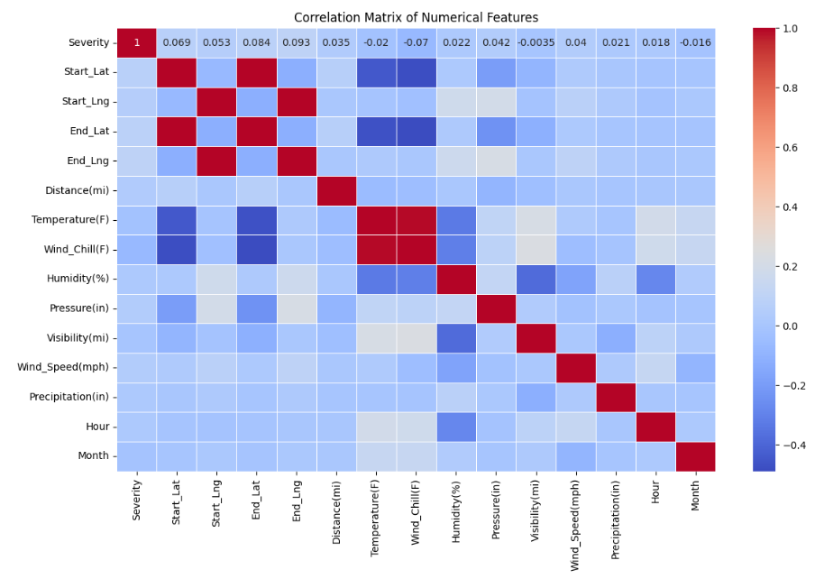
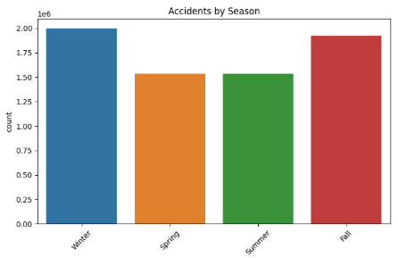
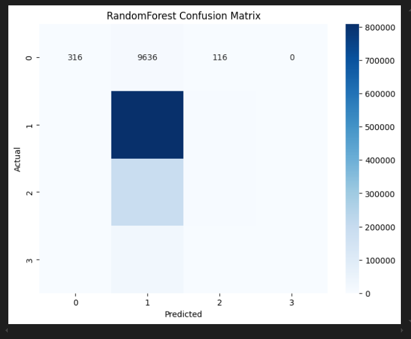

# US Traffic Accidents Analysis

## Overview
This project dives deep into US traffic accidents data to uncover valuable insights and patterns. The analysis involves meticulous data cleaning, extensive feature engineering, thorough exploratory data analysis (EDA), and the use of machine learning models to predict accident severity.

## Analysis Pipeline

### 1. Data Cleaning & Preprocessing
- **Handling Missing Values**
    - Numerical columns: Filled with median values
    - Categorical columns: Filled with mode values
    - Removed irrelevant columns: 'Description', 'Street'
    - Converted timestamps

- **Time-Based Processing**
    - Converted 'Start_Time' and 'End_Time' to datetime format
    - Calculated accident duration in minutes
    - Extracted temporal components (hour, day, month, year)

### 2. Feature Engineering

#### Temporal Features
- Extracted hour of day (0-23)
- Categorized day of the week
- Extracted month (1-12)
- Created a weekend flag (binary: 0, 1)
- Determined the season (Winter, Spring, Summer, Fall)

#### Weather Features
- Categorized weather into main groups:
    - Rain
    - Snow
    - Fog/Mist
    - Clear
    - Cloudy
    - Other

#### Duration Calculation
```python
df_processed['Duration_Minutes'] = ((df_processed['End_Time'] - 
                                                                     df_processed['Start_Time']).dt.total_seconds() / 60)
```

### 3. Exploratory Data Analysis (EDA)

#### Temporal Analysis
- Analyzed accident distribution by:
    - Hour of day (peaks during rush hours)
    - Day of week (weekday vs weekend patterns)
    - Month (seasonal patterns)
    - Year (long-term trends)

#### Severity Analysis
- Examined severity levels (1-4)
- Correlated with:
    - Weather conditions
    - Time of day
    - Location
    - Road features

#### Geographical Analysis
- State-wise accident distribution
- Severity patterns by state
- Identified high-risk areas

#### Weather Impact
- Analyzed the influence of weather conditions on:
    - Accident frequency
    - Severity levels
    - Duration of incidents

### 4. Model Development

#### Data Preparation
- Selected features highly correlated with accident severity for prediction.

```python
features = [
        # Temporal features
        'Hour', 'Is_Weekend', 'Month', 'Duration_Minutes',
        
        # Weather features
        'Temperature(F)', 'Humidity(%)', 'Pressure(in)', 
        'Visibility(mi)', 'Wind_Speed(mph)',
        
        # Binary features
        'Amenity', 'Bump', 'Crossing', 'Give_Way', 'Junction',
        'No_Exit', 'Railway', 'Roundabout', 'Station', 'Stop',
        'Traffic_Calming', 'Traffic_Signal',
        
        # Categorical features
        'Weather_Category', 'Season', 'State'
]
```

#### Feature Processing Pipeline
- **Numerical Features**
    - StandardScaler for normalization
    - Outlier handling
    - Feature scaling

- **Categorical Features**
    - One-hot encoding
    - Handling unknown categories
    - Dimension reduction for high-cardinality features

#### Model Implementation
- Batch Processing Approach
    - Custom batch creation for large dataset handling
    - Memory-efficient processing
    - Scalable implementation

```python
def batch_train_model(model, preprocessor, X, y, batch_size=1000):
        pipeline = Pipeline([
                ('preprocessor', preprocessor),
                ('classifier', clone(model))
        ])
        preprocessor.fit(X)
        
        for batch_num, (X_batch, y_batch) in enumerate(create_data_batches(X, y, batch_size)):
                # Model training logic
```

#### Models Implemented
1. **LightGBM Classifier**
     - Efficient for large datasets
     - Handles categorical features well
     - Gradient-based optimization

2. **Gradient Boosting Classifier**
     - High prediction accuracy
     - Robust to outliers
     - Feature importance ranking

3. **Random Forest Classifier**
     - Ensemble learning approach
     - Handles non-linear relationships well
     - Built-in feature importance

### 5. Evaluation Metrics
- Classification reports for each model
- Confusion matrices
- Cross-validation scores
- Feature importance analysis

## Results and Insights

1. **Severity of Accidents**
        - The dataset contains 6,000,000 instances of accidents classified with a severity level of 2.
        

2. **Accident Analysis**
        - Peak accident hours: 7AM, 8AM, 4PM, 5PM.
        - Most accidents occur on weekdays.
        - Most accidents happen in November, December, January, February.
        - Most accidents are of severity level 2.
        

3. **Weather Contribution**
        - Most accidents happen in fair weather conditions.
        - Most severe accidents (level 4) occur in light blowing snow.
        

4. **State-wise Accident Analysis**
        - California has the highest number of accidents.
        - South Dakota has the highest number of severe accidents (level 4).
        

5. **Heatmap Analysis**
        - Shows correlation between features.
        - High correlation features:
                - Start_Lat and End_Lat
                - Start_Lng and End_Lng
                - Temperature(F) and Wind_Chill(F)
        

6. **Other Important Analyses**
        
        

## Usage Examples

### Basic Data Processing
```python
# Load and preprocess data
df_engineered = preprocess_data(df)

# Create derived features
df_engineered['Is_Weekend'] = df_engineered['Day_of_Week'].apply(
        lambda x: 1 if x in ['Saturday', 'Sunday'] else 0
)
```

### Model Training
```python
# Train models with batch processing
for name, model in models.items():
        pipeline = batch_train_model(model, preprocessor, X_train, y_train_adjusted, BATCH_SIZE)
        y_pred = batch_predict(pipeline, X_val, BATCH_SIZE)
```

## Evaluation Metrics
```
        accuracy                           0.78   1047784
        macro avg       0.53      0.26      0.24   1047784
        weighted avg       0.70      0.78      0.69   1047784
```


## Future Improvements
- Implement deep learning models
- Enable real-time prediction
- Integrate additional data sources
- Apply advanced feature engineering techniques

## Dependencies
- pandas
- numpy
- scikit-learn
- xgboost
- lightgbm
- matplotlib
- seaborn
