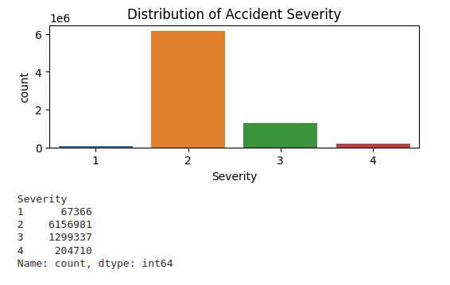
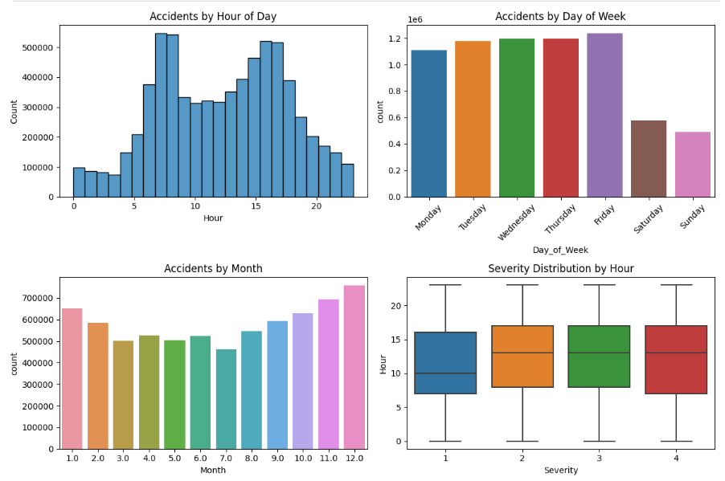
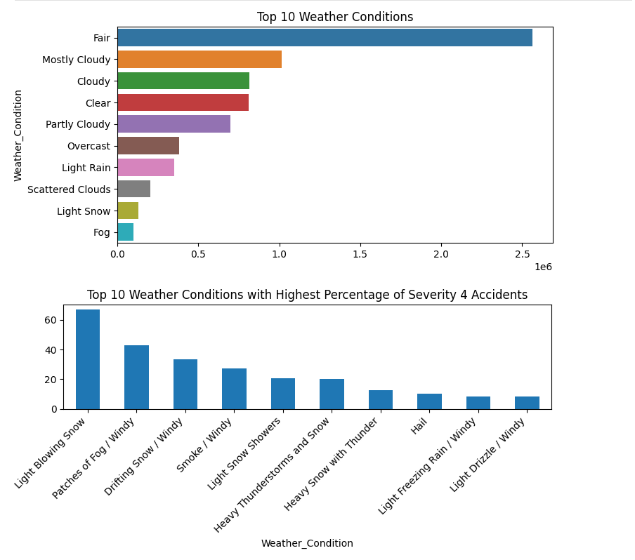
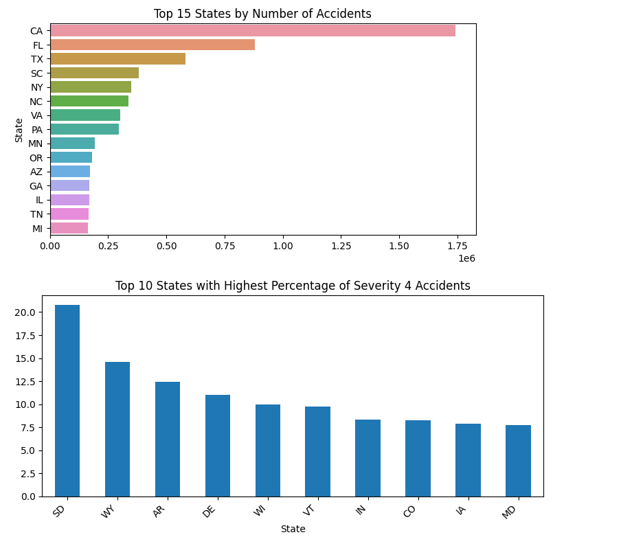
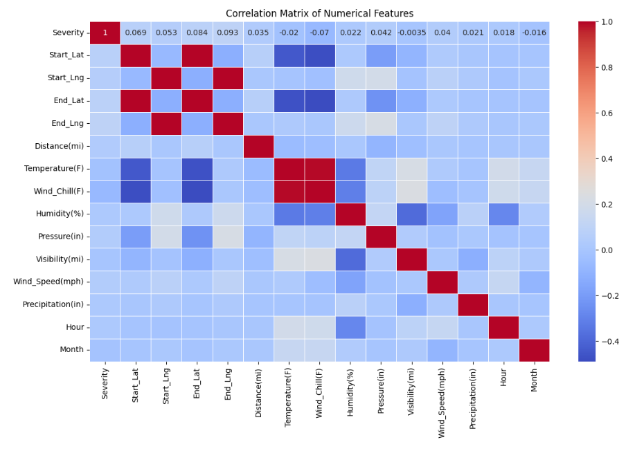
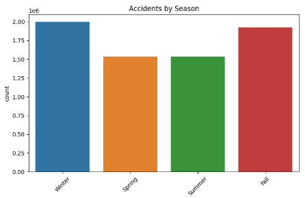
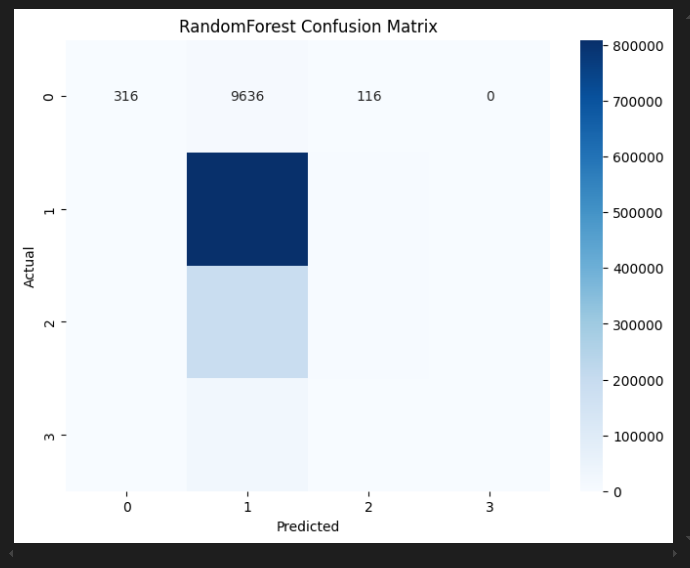

# US Traffic Accidents Analysis

## Overview
This project performs comprehensive analysis of US traffic accidents data to extract meaningful insights and patterns. The analysis pipeline includes thorough data cleaning, extensive feature engineering, in-depth exploratory data analysis (EDA), and implementation of machine learning models to predict accident severity.

## Analysis Pipeline

### 1. Data Cleaning & Preprocessing
- **Missing Value Treatment**
  - Numerical columns: Filled with median values
  - Categorical columns: Filled with mode values
  - Removal of irrelevant columns: 'Description', 'Street'
  - Handling of timestamp conversions

- **Time-Based Processing**
  - Conversion of 'Start_Time' and 'End_Time' to datetime format
  - Calculation of accident duration in minutes
  - Extraction of temporal components (hour, day, month, year)

### 2. Feature Engineering

#### Temporal Features
- Hour of day extraction (0-23)
- Day of week categorization
- Month extraction (1-12)
- Weekend flag creation (binary: 0, 1)
- Season determination (Winter, Spring, Summer, Fall)

#### Weather Features
- Weather categorization into main groups:
  - Rain
  - Snow
  - Fog/Mist
  - Clear
  - Cloudy
  - Other

#### Duration Calculation
```python
df_processed['Duration_Minutes'] = ((df_processed['End_Time'] - 
                                   df_processed['Start_Time']).dt.total_seconds() / 60)
```

### 3. Exploratory Data Analysis (EDA)

#### Temporal Analysis
- Distribution of accidents by:
  - Hour of day (peaks during rush hours)
  - Day of week (weekday vs weekend patterns)
  - Month (seasonal patterns)
  - Year (long-term trends)

#### Severity Analysis
- Distribution of severity levels (1-4)
- Correlation with:
  - Weather conditions
  - Time of day
  - Location
  - Road features

#### Geographical Analysis
- State-wise accident distribution
- Severity patterns by state
- Identification of high-risk areas

#### Weather Impact
- Analysis of weather conditions' influence on:
  - Accident frequency
  - Severity levels
  - Duration of incidents

### 4. Model Development

#### Data Preparation
```python
features = [
    # Temporal features
    'Hour', 'Is_Weekend', 'Month', 'Duration_Minutes',
    
    # Weather features
    'Temperature(F)', 'Humidity(%)', 'Pressure(in)', 
    'Visibility(mi)', 'Wind_Speed(mph)',
    
    # Binary features
    'Amenity', 'Bump', 'Crossing', 'Give_Way', 'Junction',
    'No_Exit', 'Railway', 'Roundabout', 'Station', 'Stop',
    'Traffic_Calming', 'Traffic_Signal',
    
    # Categorical features
    'Weather_Category', 'Season', 'State'
]
```

#### Feature Processing Pipeline
- **Numerical Features**
  - StandardScaler for normalization
  - Handling of outliers
  - Feature scaling

- **Categorical Features**
  - One-hot encoding
  - Handling of unknown categories
  - Dimension reduction for high-cardinality features

#### Model Implementation
- Batch Processing Approach
  - Custom batch creation for large dataset handling
  - Memory-efficient processing
  - Scalable implementation

```python
def batch_train_model(model, preprocessor, X, y, batch_size=1000):
    pipeline = Pipeline([
        ('preprocessor', preprocessor),
        ('classifier', clone(model))
    ])
    preprocessor.fit(X)
    
    for batch_num, (X_batch, y_batch) in enumerate(create_data_batches(X, y, batch_size)):
        # Model training logic
```

#### Models Implemented
1. **LightGBM Classifier**
   - Efficient handling of large datasets
   - Built-in handling of categorical features
   - Gradient-based optimization

2. **Gradient Boosting Classifier**
   - High prediction accuracy
   - Robust to outliers
   - Feature importance ranking

3. **Random Forest Classifier**
   - Ensemble learning approach
   - Good handling of non-linear relationships
   - Built-in feature importance

### 5. Evaluation Metrics
- Classification reports for each model
- Confusion matrices
- Cross-validation scores
- Feature importance analysis

## Results and Insights

1. **Severity of accident**
    - The dataset contains 6,000,000 instances of accidents classified with a severity level of 2.
    

2. **Most accident analysis**
    - Peak accident hours is 7AM, 8AM, 4PM, 5PM.
    - Peak accident happens in weekdays
    - Mostly accident happens in November, December, January, February.
    - Mostly accident are of severity level 2.
    

3. **Contribution of weather**
    - Most accidents happen in *fair* weather conditions.
    - Most accidents with severity of level 4 happens in *Light Blowing Snow*
    

4. **Accident and state relationship**
    - California has the highest number of accidents.
    - South Dakota has the highest number of accidents with severity level 4.
    

5. **Heat map - used to find the corelation within the features**
    - The heat map shows the correlation between the features.
    - From the heatmap, the features with high correlation to each other (close to 1 or -1) are:
        - Start_Lat and End_Lat
        - Start_Lng and End_Lng
        - Temperature(F) and Wind_Chill(F)
    

6. **Other important analysis**
    
    

7. **Important model parameter**
    - ```
        accuracy                           0.78   1047784
        macro avg       0.53      0.26      0.24   1047784
        weighted avg       0.70      0.78      0.69   1047784
      ```
    

## Usage Examples

### Basic Data Processing
```python
# Load and preprocess data
df_engineered = preprocess_data(df)

# Create derived features
df_engineered['Is_Weekend'] = df_engineered['Day_of_Week'].apply(
    lambda x: 1 if x in ['Saturday', 'Sunday'] else 0
)
```

### Model Training
```python
# Train models with batch processing
for name, model in models.items():
    pipeline = batch_train_model(model, preprocessor, X_train, y_train_adjusted, BATCH_SIZE)
    y_pred = batch_predict(pipeline, X_val, BATCH_SIZE)
```

## Future Improvements
- Implementation of deep learning models
- Real-time prediction capabilities
- Integration of additional data sources
- Advanced feature engineering techniques

## Dependencies
- pandas
- numpy
- scikit-learn
- xgboost
- lightgbm
- matplotlib
- seaborn